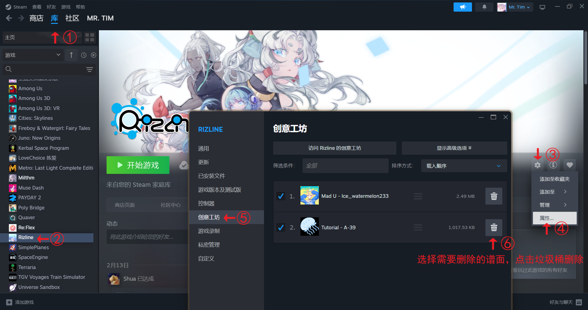

<div align=center>

</div>
<h1 align="center">Rizline SideLoader</h1>

本工具用于为Rizline PC端的“Steam创意工坊”功能侧载本地谱面。该程序通过替换创意工坊的谱面文件实现加载本地的自定义谱面，适用于家庭共享等无法上传谱面到Steam的情况。

**请勿滥用本程序加载官方内置谱面，谢谢各位小鸽子的配合。**

> 写了一个春节了，求求点个Star吧（！

# 特点

> 以下内容由Gemini 3 Pro撰写。

该项目名为 **Rizline SideLoader**，是一个基于 **Godot 4** 引擎开发的第三方工具软件，专为音乐节奏游戏《Rizline》的PC端设计。

以下是该项目的主要特点总结：

## 1. 核心功能：谱面“侧载”与替换
*   **机制**：允许用户将本地自定义谱面（Local Chart）“挂载”到 Steam 创意工坊的谱面（Workshop Chart）上。
*   **实现方式**：
    *   通过文件操作将本地谱面文件覆盖到 Steam 创意工坊目录。
    *   自动备份原始的 Steam 谱面文件（`origin_level`），支持一键还原。
    *   支持**多对多**的替换关系管理（多个本地谱面可以分别替换不同的 Steam 谱面）。

## 2. 数据与存档管理
*   **双重存档同步**：
    *   **配置文件** (`user://rizline_sideloader.cfg`)：保存本地的工具设置和替换关系。
    *   **游戏存档** (`workshop.sav`)：直接读写 Rizline 游戏的加密存档文件（通过 XOR 混淆 + GZip 压缩），用于同步替换关系和篡改/备份成绩。
*   **成绩管理**：
    *   能够读取并解析游戏的成绩数据（Score, Accuracy, Full Combo/Clear 状态等）。
    *   在替换谱面时，会自动备份原谱面的成绩；在还原替换时，会恢复原成绩。
    *   支持为本地谱面保存独立的“假”成绩记录。

## 3. UI/交互设计
*   **自定义列表控件 (`CyclicList`)**：实现了一个垂直循环滚动列表（"跑马灯"式），支持无限滚动、自动居中对齐、对象池复用（优化性能）以及平滑滚动动画。
*   **丰富的元数据显示**：在列表中展示曲绘、曲名、曲师、难度（Easy/Hard/Insane/Another）、等级数值以及详细的成绩判定（Hit/Bad/Miss）。
*   **筛选与排序**：支持按名称、等级、达成率排序；支持按全部、本地、创意工坊、收藏夹进行分组筛选。

## 4. 资源处理
*   **导入/导出**：支持处理 `.zip` 格式的谱面包，包含解压、校验文件结构（`chart.json`, `metadata.json`, 音频文件）。
*   **音频预览**：点击谱面时可自动播放音乐预览片段，支持根据 metadata 中的 `previewTime` 自动截取高潮片段并循环播放。
*   **图片加载**：能够加载本地图片，甚至从 Steam 创意工坊网页动态抓取封面图（如果本地缺失）。

## 5. 项目结构
*   **Godot 4 项目**：使用 GDScript 编写。
*   **模块化设计**：
    *   main.gd：核心控制器，处理业务逻辑和 UI 交互。
    *   cyclic_list.gd：通用的 UI 组件逻辑。
    *   save_manager.gd：专门处理二进制存档的加解密。
    *   configfile.gd：封装配置文件的读写。
    *   scroll_item.gd：单个谱面条目的展示逻辑。

简而言之，这是一个功能完善的**Mod管理工具**，它通过巧妙地接管文件和存档，让玩家能在不修改游戏主程序的情况下游玩本地自制谱面，并提供了接近原生的浏览体验。

# 使用说明

1. **准备工作**：
    *   确保已安装《Rizline》PC端，并且游戏已至少运行一次以生成必要的文件结构。（什么？你说你还没买《Rizline》PC端？[点击此处](https://store.steampowered.com/app/2272590/Rizline/)立即购买~）
    *   从 [Releases](https://github.com/html5syt/rizline-sideloader/releases) 下载最新版本的工具压缩包并解压到任意目录。
2. **运行工具**：
    *   按照提示运行即可。工具会自动检测游戏目录和创意工坊目录，并加载现有的谱面列表。
3. **添加本地谱面**：
    *   点击“添加谱面”按钮，选择一个包含 `chart.json` 和 `metadata.json` 的 `.zip` 文件。（具体说明参考下文）
    *   工具会自动解压并验证文件结构，成功后会将该谱面添加到列表中。
4. **替换谱面**：
    *   选择一个Steam谱面，点击“SET”按钮，设置该谱面为被本地谱面替换的目标。
    *   选择一个本地谱面，点击“LOAD”按钮，即可将该本地谱面挂载到之前设置的Steam谱面上。
5. **还原谱面**：
    *   重复4的步骤，根据提示操作即可还原回原始的Steam谱面。
6. **删除谱面**：
    *   选择一个谱面，点击左上角“书签”按钮，即可将该谱面从列表中删除。**注意：请阅读下方说明以解决一些问题。**
7. **设置**：
    *   点击“设置”按钮，可以配置相关路径，**还可以快捷打开Rizline相关的位置和程序。**

# 注意事项
## 1. **备份数据**：
虽然工具会自动备份存档，但建议在使用前手动备份重要数据，以防意外情况发生。你可以在“设置”界面中找到“打开Rizline PC端存档路径”按钮来手动打开存档目录并备份当前的存档数据。

## 2. **关于谱面包**
*   谱面包必须是 `.zip` 格式，且内部必须包含如下所示结构的文件：
```
D:\DESKTOP\TUTORIAL-A-39-EZ.1.zip
    3660880506
    chart.json
    metadata.json
    song.ogg
```
*   `chart.json`：包含谱面数据的JSON文件，必须符合Rizline的谱面格式规范。
*   `metadata.json`：包含谱面元数据的JSON文件，必须包含以下字段：
```jsonc
{
    "title": "Tutorial", // 曲名
    "composer": "A-39", // 曲师
    "difficulty": 0, // 难度（0=Easy, 1=Hard, 2=Insane, 3=Another）
    "level": 1, // 等级数值
    "maxHit": 36, // 最大打击判定数（Hit/Bad/Miss的总和）
    "maxScore": 1001100, // 理论最高分数（用于计算达成率）
    "previewTime": 1.00000143 // 预览段开始位置占比（计算公式：(音乐总时长-20s)*previewTime=预览段开始时间点，播放20s）
}
```
*   `song.ogg`：包含谱面音乐的音频文件，必须为OGG/MP3格式。
*   `3660880506`：Steam谱面的曲绘文件，必须为PNG/JPG格式，且文件名必须与目标Steam谱面的ID一致。**若为本地谱面则为“illustration”**。均无扩展名。

## 3. **关于“关卡已损坏”**

如果在程序中删除Steam关卡后，在游戏中看到“关卡已损坏”的提示，且不会自动恢复时，可以按照以下步骤手动解决：

0. 在设置里点击“打开Steam谱面路径”按钮，打开Steam谱面目录，确认对应谱面是否已被删除。
1. 在创意工坊中取消订阅该谱面。
2. 打开Steam中“库-Rizline-开始游戏右侧的齿轮按钮-属性-创意工坊”，手动删除对应的谱面。


## 4. **关于成绩**
*   当替换谱面时，工具会自动备份原谱面的成绩数据，并将其与本地谱面关联；当还原谱面时，会恢复原成绩。
*   本地谱面会写入到游戏存档中，可以正常同步到Steam云存档中，但不会被游戏识别为正式成绩，因此在游戏内不会显示成绩数据。
*   若在同步时提示存档冲突，请选择“保留本地存档”，以确保本地谱面和成绩数据不会丢失。


# 贡献&反馈

欢迎提交Pull Request或Issue来贡献代码和反馈问题！如果你有任何关于功能改进、Bug修复或者其他方面的建议，请随时提出。我会抽空进行回复和处理。

## To English speakers:

If you want the English version of this Project, please issue me to let me add the English translation. Thanks for your support!

# License
该项目采用GNU General Public License v3.0（GPL-3.0）许可证，允许用户自由使用、修改和分发代码，但要求任何衍生作品必须同样采用GPL-3.0许可证发布，并且必须公开源代码。详细信息请参阅[LICENSE](LICENSE)文件。

# Star History

<a href="https://www.star-history.com/#html5syt/Rizline-SideLoader&type=date&legend=bottom-right">
 <picture>
   <source media="(prefers-color-scheme: dark)" srcset="https://api.star-history.com/svg?repos=html5syt/Rizline-SideLoader&type=date&theme=dark&legend=bottom-right" />
   <source media="(prefers-color-scheme: light)" srcset="https://api.star-history.com/svg?repos=html5syt/Rizline-SideLoader&type=date&legend=bottom-right" />
   
 </picture>
</a>